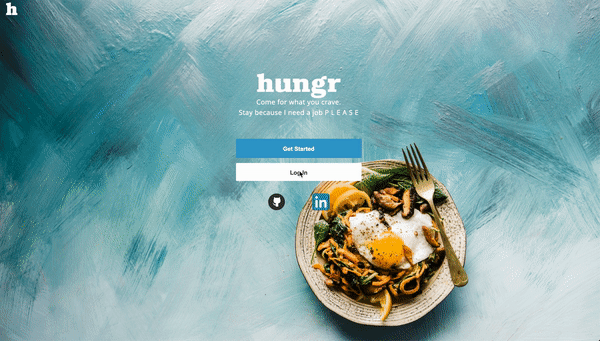
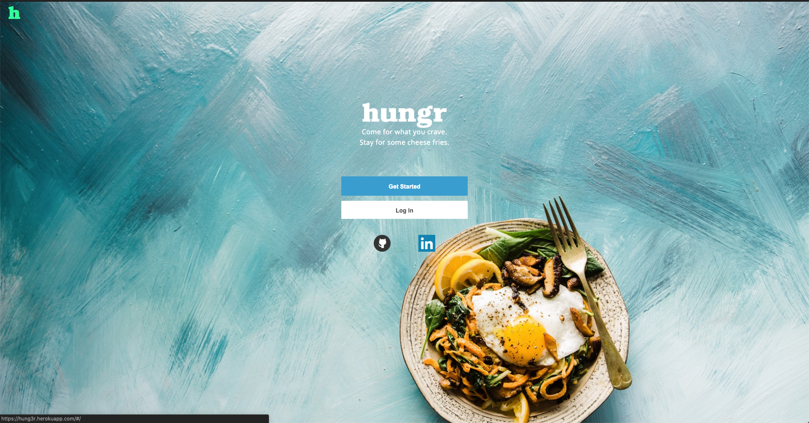
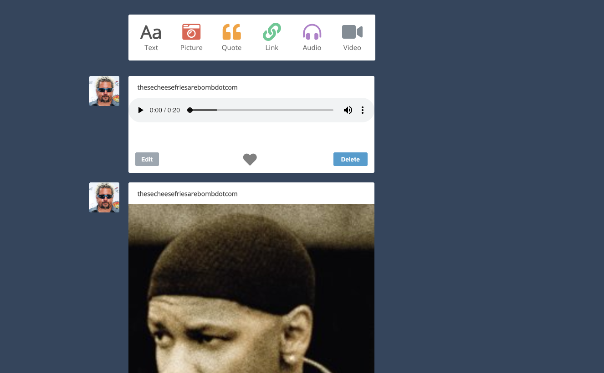
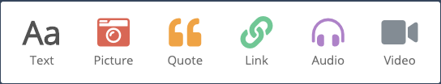
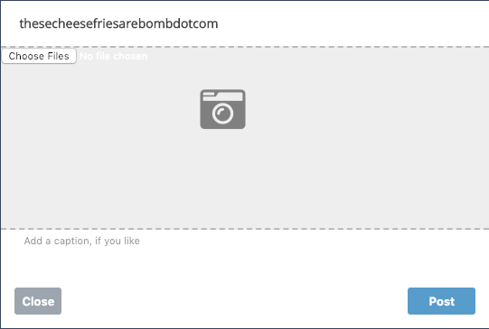
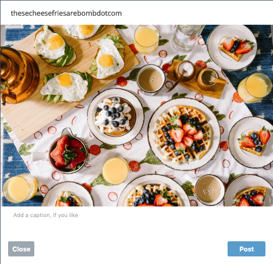

### Hungr

## [Live Link](https://hung3r.herokuapp.com/#/) 




Hungr is a food blogging site, inspired by Tumblr. Users can sign up, make different types of posts(text, image, media, etc), and have an index of all of their posts and of their followed users.
It was built using a Rails backend, and React / Redux frontend, PostgreSQL database, with AWS to host different types of media.

# Auth
Front end and back end auth is baked into the core of the app, preventing unauthorized access based on valid credentials. A switch is used to redirect the user from a splash page to either a login or signup page, rendered using React.

```js
<from app.jsx>
      <ProtectedRoute path="/" component={NavContainer} />
      <Switch>
            <ProtectedRoute path="/dashboard" component={Dashboard} />
            <ProtectedRoute path="/profile" component={Profile} />
            <AuthRoute exact path="/login" component={LogInFormContainer} />
            <AuthRoute path="/" component={SplashContainer} />
      </Switch>
```



## Features

#Dashboard
The user's dashboard has both posts that they made, as well as posts of the people they're following. It's populated by querying the database. They can choose to either edit or delete posts - but only their own.



# Dashboard Nav
Posts are created using different buttons, implementing React to edit the front end state to accomodate the brought up associated form. A preview is then generated.








# Profile

The user's profile is rendered to show their personal posts, these are all the working parts into a single post

```rb
<from post.jsx>
      <> 
         <div className="individual_post" >
            <p className="post_form_username">{this.props.currentUser.username}</p>
            <div className="post_wrapper">
               
               {content}
               <p className="post_body">{this.props.post.body}</p>
               <div className="form_buttons">
               {editForm}
               {likeBool}
               < CommentModal id={this.props.post_id} post={modalPost} className="comment_modal" post_id={this.props.post_id}/>
               </div>
            </div>
         </div>    
      </>
```

